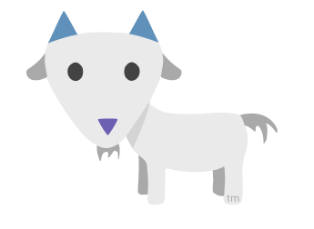

# Voat
[](https://ci.appveyor.com/project/voat/voat/branch/master)
[](https://raw.githubusercontent.com/voat/voat/master/LICENSE)



This is the code behind http://www.voat.co.

### Description
Voat is a media aggregator and community platform developed in C# ASP.NET MVC 5.

### Dependencies and attributions
Voat uses SQL server and .NET framework 4.5.

The following 3rd party libraries/extensions are used:

- Markdowndeep (http://www.toptensoftware.com/markdowndeep)
- Entity Framework (https://entityframework.codeplex.com)
- WebApiThrottle (https://github.com/stefanprodan/WebApiThrottle)
- SignalR (https://github.com/SignalR/SignalR)
- OpenGraph-Net (https://github.com/ghorsey/OpenGraph-Net)
- .NET Image Library (https://www.nuget.org/packages/ImageLibrary)
- HtmlAgilityPack (http://www.nuget.org/packages/HtmlAgilityPack)
- Bootstrap (http://getbootstrap.com)
- jQuery (http://jquery.com)

### Installation instructions
Follow these steps to get up and running:

#### step 1
- Create databases and database owners.
Voat uses 2 SQL databases to store messages, comments, votes, users etc. 
Default database names are Voat and voatUsers.
You can use voat.sql and voatUsers.sql to generate necessary tables for each respective database.

#### step 2
- After cloning this repository, you will need to modify and place Web.config file in Voat.UI folder (the same folder where the file packages.config is located). You need to modify the following two connection strings in this file to reflect your SQL server address, port, database names and database usernames: 
```
<add name="voatUsers" connectionString="Data Source=yourdomain.com, 1433;Initial Catalog=voatUsers;Persist Security Info=True;User ID=yourusername;Password=yourpassword" providerName="System.Data.SqlClient" />
<add name="voatEntities" connectionString="metadata=res://*/Models.VoatEntityDataModel.csdl|res://*/Models.VoatEntityDataModel.ssdl|res://*/Models.VoatEntityDataModel.msl;provider=System.Data.SqlClient;provider connection string=&quot;data source=yourdomain.com;initial catalog=voat;persist security info=True;user id=yourusername;password=yourpassword;MultipleActiveResultSets=True;App=EntityFramework&quot;" providerName="System.Data.EntityClient" />
```
- You need to sign up for recaptcha service at https://www.google.com/recaptcha/admin#whyrecaptcha to get your public and private recaptcha keys
- Once you have your recaptcha keys, you need to modify the Web.config file and in section `<appSettings>`, you need to add the following for your keys:
```
<add key="recaptchaPublicKey" value="your public key goes here" />
<add key="recaptchaPrivateKey" value="your private key goes here" />
```
#### step 3
- Reinstall dependencies (binaries for NuGet packages) by issuing the following command in Package Manager Console (when asked to overwrite existing files, choose no for all:
Update-Package -Reinstall

### After installation
Start by creating your user account. The frontpage will be empty, so you should start by creating a subverse.
After creating your subverse, you can visit it (localhost/v/yourtestsubverse) and start posting stories or links. You can then comment on these stories and vote on them.

### Why was this made?
This was just a hobby project to help me get a better understanding of C# and ASP.NET MVC and Entity Framework.

### How does Voat differ from related projects?
- based in Switzerland, no censorship policy as long as content is legal in Switzerland
- ad revenue sharing model (in development, we will disclose more details soon) where community is rewarded with real money for quality original content
- deterministically scaling voting quota
- limited voting (new users need to gain a certain amount of points before they are able to vote without restrictions)
- limited number of owned/moderated subs per user (10)
- voat has increased focus on privacy. It enables users to delete their account by automatically overwriting every comment and every submission the user has made with a string "deleted", before proceeding to remove the user account from user credentials database. 
- built-in night mode
- subverse set system similar to the one used on Google News
- realtime notifications for user mentions, post and comment replies
- realtime chat for every subverse
- markdown toolbar for user friendly text editing
- automatic expando creation for many popular services
- anonymized mode: subverse owners can irreversibly convert their subverse to anonymized mode which hides all usernames and disables all voting actions within that subverse
- responsive design which works great on mobile out of the box
- user profiles show statistics about user activity, for example, submission distribution and highest-lowest rated submissions and a short biography with avatar

### What does the future hold?
Voat aims to make a media aggregator platform with new ideas and unique features that set Voat apart from similar platforms.

### Contributing
There is a whole lot of work to be done, code contributions are more than welcome. By submitting a pull request, you are agreeing for your contribution to be distributed under GPL V3 license (the same license voat uses for the rest of voat project).
